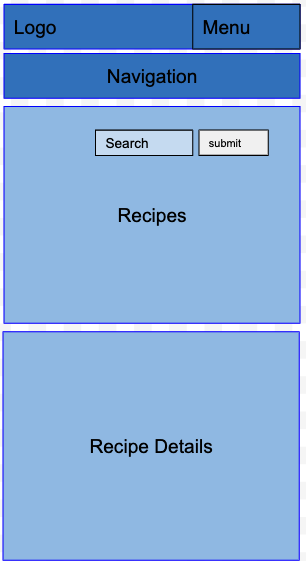
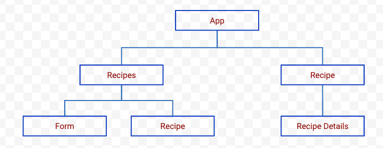

#
**Project Proposal**

##
**_Project Description_**

My app is called CookPot. It's a recipe app designed for users who have hard time figuring out which meal to cook. Users can search recipes across the world and then click on a specific dish to see description of recipe. In the future I'd like to add a feature of nutrition facts for each recipe.

##
**_Wireframes_**



##
**_MVP_**

##
**_User Stories_**

* As a user, I would be able to search recipe using input search bar.

* As a user, I want to see listing of all recipes based on search criteria.

* As a user, I want to be able to navigate the recipes on my mobile phones so that I can see recipe details.

##
**_Post MVP Stretch Goal_**

* As a user, I would like to filter recipes by name so that I can easily find a recipe and view its details.

* As a user, I would like to filter recipes by type, so that I can more easily select recipes based on the type of recipe I'm interested in making a dish.

##
**_API_**

[Edamam API Documentation](https://developer.edamam.com/edamam-docs-nutrition-api)

Sample Json

```json
{
q: "chicken",
from: 0,
to: 10,
more: true,
count: 168106,
hits: [
{
recipe: {
uri: "http://www.edamam.com/ontologies/edamam.owl#recipe_b79327d05b8e5b838ad6cfd9576b30b6",
label: "Chicken Vesuvio",
image: "https://www.edamam.com/web-img/e42/e42f9119813e890af34c259785ae1cfb.jpg",
source: "Serious Eats",
url: "http://www.seriouseats.com/recipes/2011/12/chicken-vesuvio-recipe.html",
shareAs: "http://www.edamam.com/recipe/chicken-vesuvio-b79327d05b8e5b838ad6cfd9576b30b6/chicken",
yield: 4,
dietLabels: [
"Low-Carb"
],
healthLabels: [
"Sugar-Conscious",
"Peanut-Free",
"Tree-Nut-Free"
],
cautions: [
"Sulfites"
],
ingredientLines: [
"1/2 cup olive oil",
"5 cloves garlic, peeled",
"2 large russet potatoes, peeled and cut into chunks",
"1 3-4 pound chicken, cut into 8 pieces (or 3 pound chicken legs)",
"3/4 cup white wine",
"3/4 cup chicken stock",
"3 tablespoons chopped parsley",
"1 tablespoon dried oregano",
"Salt and pepper",
"1 cup frozen peas, thawed"
],
ingredients: [
{
text: "1/2 cup olive oil",
weight: 108
},
{
text: "5 cloves garlic, peeled",
weight: 15
},
{
text: "2 large russet potatoes, peeled and cut into chunks",
weight: 532.5
},
{
text: "1 3-4 pound chicken, cut into 8 pieces (or 3 pound chicken legs)",
weight: 1587.5732950000001
},
{
text: "3/4 cup white wine",
weight: 169.5
},
{
text: "3/4 cup chicken stock",
weight: 180
},
{
text: "3 tablespoons chopped parsley",
weight: 11.399999999999999
},
{
text: "1 tablespoon dried oregano",
weight: 5.9999999998985585
},
{
text: "Salt and pepper",
weight: 16.463839769999392
},
{
text: "Salt and pepper",
weight: 8.231919884999696
},
{
text: "1 cup frozen peas, thawed",
weight: 134
}
]
```


##
**_Component Hierarchy_**

