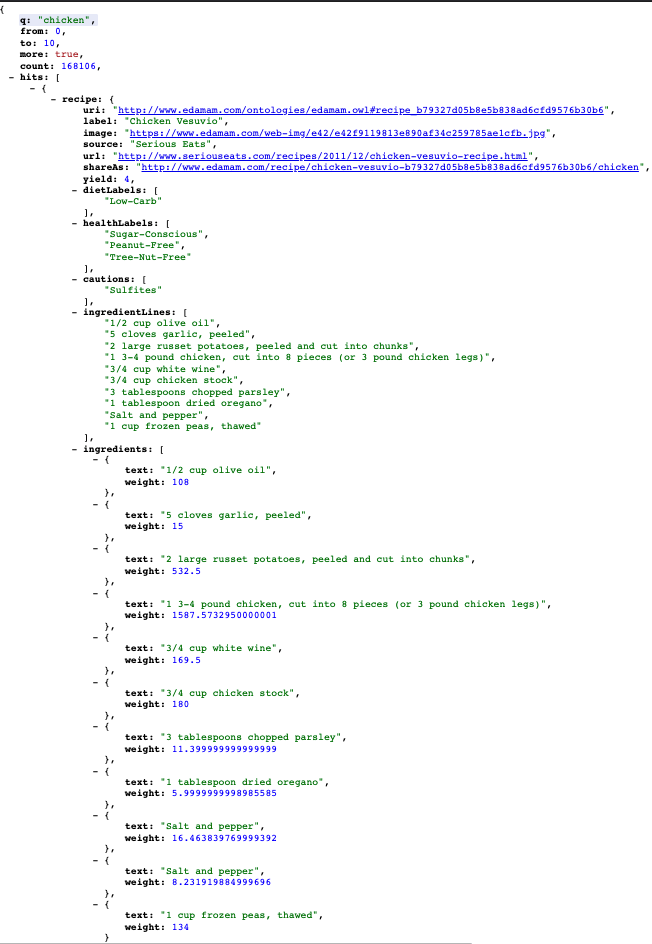

#
**Project Proposal**

##
**_Project Description_**

My app is called CookPot. It's a recipe app designed for users who have hard time figuring out which meal to cook. Users can search recipes across the world and then click on a specific dish to see description of recipe. In the future I'd like to add a feature of nutrition facts for each recipe.

##
**_Wireframes_**

##
**_MVP_**

##
**_User Stories_**

* As a user, I would be able to search recipe using input search bar.

* As a user, I want to see listing of all recipes based on search criteria.

* As a user, I want to be able to navigate the recipes on my mobile phones so that I can see recipe details.

##
**_Post MVP Stretch Goal_**

* As a user, I would like to filter recipes by name so that I can easily find a recipe and view its details.

* As a user, I would like to filter recipes by type, so that I can more easily select recipes based on the type of recipe I'm interested in making a dish.

##
**_API_**

[Edamam API Documentation](https://developer.edamam.com/edamam-docs-nutrition-api)

Sample Json

##
**_Component Hierarchy_**

