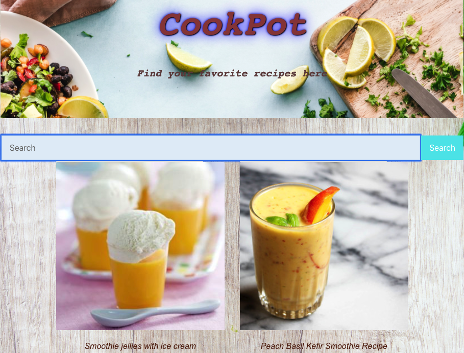

# React_Project

##
**_Project Description_**

My app is called CookPot. It's a recipe app designed for users who have hard time figuring out which meal to cook. Users can search recipes across the world and then click on a specific dish to see description of recipe. I used React, React Bootstrap and react Hooks to build this project.

##
**_Wireframes_**

 

##
**_Example_**

This is what app looks like

##
**_MVP_**

##
**_User Stories_**

* As a user, I would be able to search recipe using input search bar.

* As a user, I want to see listing of all recipes based on search criteria.

* As a user, I want to be able to navigate the recipes on my mobile phones so that I can see recipe details.

##
**_Post MVP Stretch Goal_**

* As a user, I would like to filter recipes by name so that I can easily find a recipe and view its details.

* As a user, I would like to filter recipes by type, so that I can more easily select recipes based on the type of recipe I'm interested in making a dish.

##
**_Installation Instructions_**

To set up app locally on your system: 

Fork and clone this repository

Install npm dependencies

Install VsCode locally and ensure it is running.

Lastly, start your server using npm start command in CLI.

##
**_Contribute_**

Source code: https://github.com/statst/React_Project

Search your favorite recipe here: https://cookpot.herokuapp.com/
